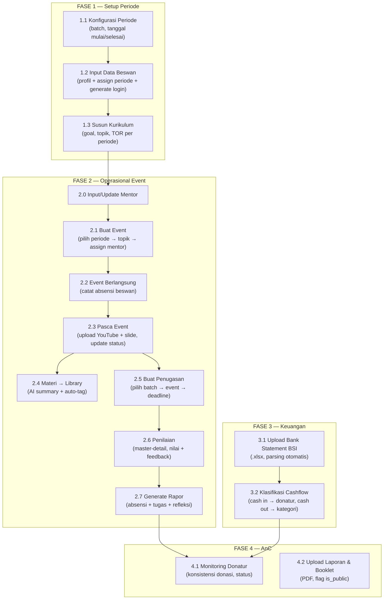
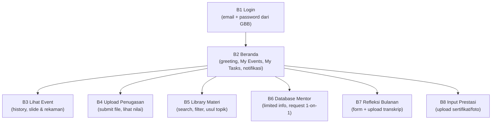
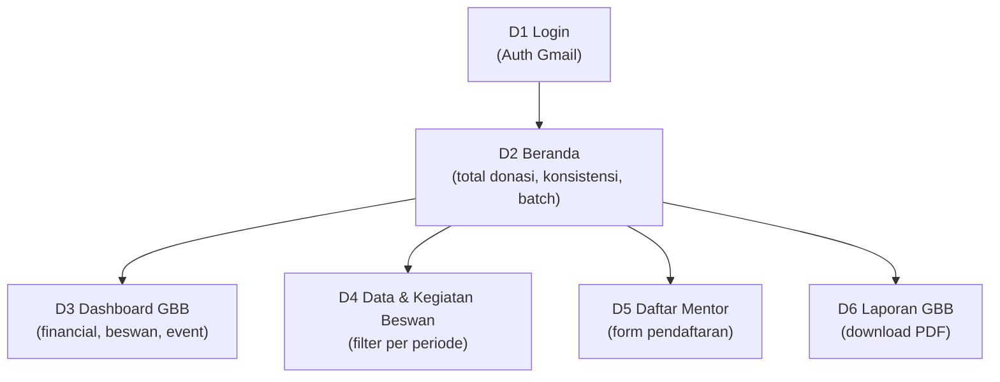

# Implementation Plan — Portal Web GBB (v3 Final)

> **Version**: 3.0 | **Date**: 17 Mei 2026 | **Status**: 🟡 Menunggu Approval

---

## Goal

Membangun Portal Web GBB di `portal.baikberdampak.org` dengan 3 sub-portal (Internal, Beswan, Donatur). Front-end → back-end, checkpoint konfirmasi di setiap fase.

---

## Resolved Decisions ✅

| Item | Keputusan |
|------|-----------|
| **Server** | VPS Hostinger 16GB RAM, Linux, Nginx |
| **Domain** | `portal.baikberdampak.org` |
| **Database** | PostgreSQL self-hosted di VPS |
| **File Storage** | MinIO self-hosted di VPS (S3-compatible) |
| **Auth** | Better Auth — single login, role-based routing, develop last |
| **Refleksi** | 10 dummy pertanyaan (editable admin) |
| **Sheets Sync** | Donatur, Pendaftar Talkshow, Feedback → mirror via Google Sheets API |
| **Cashflow** | Upload bank statement BSI (.xlsx) + klasifikasi manual |

✅ Tidak ada open question tersisa.

---

## Final Tech Stack

```
┌──────────────────────────────────────┐
│           FRONTEND (SPA)             │
│  React 18 + Vite + TypeScript        │
│  Shadcn/ui + Tailwind CSS v3         │
│  TanStack Table (data tables)        │
│  TanStack Router (SPA routing)       │
│  Recharts (dashboard charts)         │
│  React Hook Form + Zod (validation)  │
├──────────────────────────────────────┤
│           BACKEND (API)              │
│  Express.js + TypeScript             │
│  Drizzle ORM                         │
│  Better Auth (email/password + Gmail)│
│  Multer + MinIO SDK (file upload)    │
│  node-cron (scheduled sync)          │
│  xlsx (BSI bank statement parsing)   │
│  Resend (email service, free tier)   │
│  React Email (email templates)       │
├──────────────────────────────────────┤
│         INFRASTRUCTURE               │
│  PostgreSQL 16                       │
│  MinIO (S3-compatible storage)       │
│  Nginx (reverse proxy + SSL)         │
│  PM2 (process manager)               │
│  VPS Hostinger 16GB Linux            │
└──────────────────────────────────────┘
```

| Layer | Teknologi | Alasan |
|-------|-----------|--------|
| **Frontend** | React 18 + Vite | Cepat, ringan, SPA ideal untuk portal |
| **UI** | Shadcn/ui + Tailwind CSS | Futuristik, customizable, component-based |
| **Data Tables** | TanStack Table | Sort, filter, pagination, search — best-in-class |
| **Routing** | TanStack Router | Type-safe SPA routing, code splitting |
| **Forms** | React Hook Form + Zod | Validation kuat, TypeScript-first |
| **Charts** | Recharts | Dashboard visualisasi |
| **Backend** | Express.js + TS | Battle-tested, full control |
| **ORM** | Drizzle | SQL-like, type-safe, ringan, performa tinggi |
| **Auth** | Better Auth | Framework-agnostic, Drizzle adapter, role-based |
| **File Upload** | Multer + MinIO | Upload → MinIO buckets |
| **Scheduler** | node-cron | Google Sheets sync, alert checks, email reminders |
| **Excel Parser** | xlsx / ExcelJS | BSI bank statement parsing |
| **Email Service** | Resend | 3,000 emails/bulan gratis, API simple |
| **Email Templates** | React Email | JSX email templates, konsisten dengan UI |

---

## Application Flow Summary

### Actor 1: Tim Internal (PCM / Finance / AnC)



### Actor 2: Beswan



### Actor 3: Donatur



---

## Key Business Rules

| Rule | Detail |
|------|--------|
| **Periode = 6 bulan fixed** | Hanya 2 opsi: **Jan–Jun** atau **Jul–Des**. Tidak ada variasi lain |
| **Multi-periode aktif** | Bisa >1 periode aktif bersamaan (jika pembinaan molor). Sistem harus support filter per periode |
| **Multi-batch beswan** | 1 beswan bisa di >1 periode. Artinya: punya >1 rapor, >1 set absensi, >1 set tugas (semua per periode) |
| **Beswan = 6 bulan** | Durasi beswan per periode = 6 bulan, sesuai periode |
| **Donatur daftar per periode** | Donatur daftar 1x per periode. Periode berikutnya → ditanya ulang. Tim AnC centang di portal jika lanjut |
| **Donatur kolom periode auto** | Kolom periode baru otomatis muncul di Database Donatur saat periode baru dikonfigurasi |
| **Kode donatur** | Auto-generated: `[Inisial][Semester][Tahun]`. Detail di bawah |
| **Absensi** | Dicatat oleh tim internal, bukan beswan |
| **Penugasan submit** | Setelah submit, tidak bisa edit ulang |
| **Refleksi alert** | Wajib bulanan, terkoneksi periode batch |
| **Prestasi alert** | Wajib update per kuartal |
| **Donatur visibility** | Hanya lihat beswan dari periode di mana ia aktif |
| **Mentor privacy** | Portal Beswan: tanpa HP & CV |
| **Login beswan** | Email + password (generated) |
| **Login donatur** | Gmail OAuth |
| **BSI parsing** | Baca dari baris ke-13, detect CR/DB, dedup by FT Number |

### Kode Donatur — Auto-Generation Rules

**Format**: `[Inisial Nama][Semester Join][Tahun Join]`

| Komponen | Aturan | Contoh |
|----------|--------|--------|
| **Inisial** | Huruf pertama tiap kata, uppercase | Dendy Lisna Wansyah → `DLW` |
| **Semester** | `1` = Jan–Jun, `2` = Jul–Des | Jan–Jun → `1` |
| **Tahun** | 4 digit tahun join | 2025 → `2025` |

**Contoh verifikasi:**

| Nama | Kode | Breakdown |
|------|------|-----------|
| Dendy Lisna Wansyah | `DLW12025` | DLW + sem1 + 2025 |
| Ike Agustin Hartanto Putri | `IAH22024` | IAH + sem2 + 2024 |
| Yusuf Sufyan | `YS22024` | YS + sem2 + 2024 |
| Peni Anggraelin | `PA22024` | PA + sem2 + 2024 |
| Royhana | `R12025` | R + sem1 + 2025 |

**Edge cases:**

| Case | Aturan | Contoh |
|------|--------|--------|
| Nama 1 kata | Hanya 1 huruf inisial | Royhana → `R12025` |
| Nama panjang | Tetap ambil inisial semua kata | Muhammad Alfawza Biljannah → `MAB` |
| **Collision** | Extend inisial nama terakhir jadi 2 huruf | Yusuf Sufyan → `YSU22024`, Yusuf Santoso → `YSA22024` |

---

## Project Structure (Anti-Hallucination Strategy)

> Prinsip: **isolasi per portal, 1 file < 200 baris, schema per domain**

```
GBB/
├── client/src/                     # React + Vite frontend
│   ├── components/
│   │   ├── ui/                     # Shadcn (Button, Input, Modal, dll)
│   │   └── shared/                 # MetricCard, Sidebar, Badge, DataTable
│   ├── portals/
│   │   ├── internal/               # Portal Internal (isolated)
│   │   │   ├── layout.tsx
│   │   │   └── pages/              # 1 folder per halaman
│   │   │       ├── dashboard/      # index + EventTab + GrowthTab + BeswanTab
│   │   │       ├── beswan/         # index + Table + Detail + Rapor
│   │   │       ├── kurikulum/
│   │   │       ├── mentor/
│   │   │       ├── event/
│   │   │       ├── penugasan/
│   │   │       └── keuangan/       # rekonsiliasi/ + database-donatur/ + monitoring/
│   │   ├── beswan/                 # Portal Beswan (isolated)
│   │   │   ├── layout.tsx
│   │   │   └── pages/              # beranda/ library/ mentor/ refleksi/ profile/
│   │   └── donatur/                # Portal Donatur (isolated)
│   │       ├── layout.tsx
│   │       └── pages/              # beranda/ mentor/ dashboard/ beswan/ laporan/
│   ├── hooks/                      # Shared hooks
│   ├── lib/                        # API client, utils
│   ├── styles/                     # Global CSS, theme tokens
│   └── types/                      # Shared TypeScript types
│
├── server/src/                     # Express backend
│   ├── db/
│   │   ├── schema/                 # 1 file per domain
│   │   │   ├── core.ts             # periode, users
│   │   │   ├── beswan.ts           # beswan, beswan_periode, refleksi, prestasi
│   │   │   ├── donatur.ts          # donatur, donatur_periode
│   │   │   ├── event.ts            # topik, event, event_mentor, event_beswan, feedback
│   │   │   ├── penugasan.ts        # penugasan, hasil_penugasan
│   │   │   ├── cashflow.ts
│   │   │   ├── library.ts          # library, topik_usulan
│   │   │   ├── sistem.ts           # laporan, notifikasi, mentor_request
│   │   │   └── index.ts            # barrel export
│   │   └── migrations/
│   ├── routes/                     # 1 file per entity
│   ├── services/                   # Business logic per domain
│   ├── email/                      # Resend + React Email templates
│   ├── cron/                       # Scheduled jobs
│   ├── middleware/                  # Auth, error handling
│   └── lib/                        # Utilities
│
└── docs/                           # Planning docs (existing)
```

### Development Rules

| Rule | Detail |
|------|--------|
| **Kerja per halaman** | Fokus 1 halaman per sesi, baca hanya file relevan |
| **File max ~200 baris** | Pecah komponen besar ke sub-components |
| **Portal terisolasi** | Internal, Beswan, Donatur tidak saling import |
| **Shared components reusable** | Dibuat di Phase 0, reuse di semua portal |
| **Schema per domain** | Bukan 1 file raksasa, import via barrel `index.ts` |
| **Types centralized** | Shared types di `types/`, per-page types inline |

---

## Delivery Phases

### Phase 0: Foundation & Setup
- Init monorepo: `/client` (React+Vite) + `/server` (Express)
- Tailwind + Shadcn/ui setup
- Design system: theme, color palette, typography
- Reusable UI components (Button, Input, Table, Card, Modal, Sidebar, MetricCard, Badge, Alert)
- Express boilerplate + Drizzle config

### Phase 1: Front-End Portal Internal ✋
- **1A** Layout & sidebar (6 menu + dashboard)
- **1B** Database Beswan (metrics, table, detail, rapor)
- **1C** Kurikulum & Library (tabs, upload, tagging)
- **1D** Database Mentor (metrics, table, detail, feedback)
- **1E** Event Talkshow (metrics, table, create wizard, alert)
- **1F** Penugasan (master-detail, create wizard, grading)
- **1G** Dashboard (3 sections: Event, Growth, Beswan)
- **1H** Keuangan (BSI upload, klasifikasi, cashflow view)
- **1I** Monitoring Donatur & Laporan

### Phase 2: Front-End Portal Beswan ✋
- **2A** Layout & navigation
- **2B** Beranda (greeting, My Events, My Tasks, Prestasiku)
- **2C** Library Materi (reuse + usul topik)
- **2D** Mentor (limited view, request 1-on-1)
- **2E** Refleksi Bulanan (form + prestasi)
- **2F** Profile (edit data, upload CV)

### Phase 3: Front-End Portal Donatur ✋
- **3A** Layout & navigation
- **3B** Beranda (donasi info, konsistensi, IG highlights)
- **3C** Daftar Mentor! (form, metrics)
- **3D** Dashboard GBB (financial, beswan, event)
- **3E** Data & Kegiatan Beswan (period filter)
- **3F** Laporan GBB + Profile

### Phase 4: Back-End ✋
- **4A** PostgreSQL schema + Drizzle migrations
- **4B** Better Auth setup (email/password + Gmail OAuth)
- **4C** MinIO setup (buckets)
- **4D** CRUD API routes (all entities)
- **4E** Google Sheets sync service (cron)
- **4F** BSI bank statement parser
- **4G** File upload/download API
- **4H** Email notification service (Resend + React Email)
- **4I** Cron-based reminder system (refleksi, prestasi, tugas)

### Phase 5: Integration & Polish ✋
- Connect frontend ↔ backend
- Real data flow testing
- Responsive testing (mobile, tablet, desktop)
- Loading states, error handling, empty states
- Performance optimization

### Phase 6: Deployment ✋
- Setup PostgreSQL + MinIO + Node.js di VPS
- Nginx config (reverse proxy, SSL via Let's Encrypt)
- PM2 process manager
- DNS subdomain setup (`portal.baikberdampak.org`)
- Monitoring & logging

---

## Google Sheets Mirroring Strategy

| Sheet | Mode | Data yang di-sync | Frequency |
|-------|------|-------------------|----------|
| Database Donatur | **Mirror** (profile only) | Hanya sampai kolom **Akun Media Sosial** (profil). Partisipasi per-periode dikelola di portal oleh AnC | Setiap 15 menit |
| Pendaftar Talkshow | **Mirror** (live sync) | Semua kolom | Setiap 15 menit |
| Feedback Talkshow | **Mirror** (live sync) | Semua kolom | Setiap 15 menit |
| Cashflow Categories | **One-time import** | Semua kolom | Manual |

Mekanisme:
- Google Sheets API v4 + Service Account (read-only, gratis)
- node-cron di Express → fetch → upsert ke PostgreSQL
- Deduplication by timestamp + nama/index

> [!IMPORTANT]
> **Database Donatur — pemisahan data:**
> - **Dari Google Sheets**: profil donatur (nama, email, HP, organisasi, nominal, skema, dll — sampai kolom Akun Media Sosial)
> - **Dari Portal (managed by AnC)**: kode donatur (auto-generated), status per-periode (centang aktif/tidak per batch), donatur_periode records
> - Kolom periode baru **otomatis muncul** di tabel Database Donatur saat admin membuat periode baru di Konfigurasi Periode

---

## Email Notification & Reminder System

**Tech**: Resend (3,000 emails/bulan gratis) + React Email (JSX templates)

### Notifikasi Beswan (Email)

| # | Trigger | Kapan | Tipe |
|---|---------|-------|------|
| 1 | **Welcome email** | Saat akun beswan dibuat | Instant |
| 2 | **Tugas baru** | Saat penugasan di-publish | Instant |
| 3 | **Tugas dinilai** | Saat PCM submit nilai + feedback | Instant |
| 4 | **Reminder refleksi** | Tanggal 25 setiap bulan, jika belum submit | Cron |
| 5 | **Reminder prestasi** | Minggu terakhir kuartal (Mar/Jun/Sep/Des) | Cron |
| 6 | **Event reminder** | H-1 sebelum event | Cron |

### Notifikasi Donatur (Email)

| # | Trigger | Kapan | Tipe |
|---|---------|-------|------|
| 1 | **Welcome email** | Saat akun donatur dibuat | Instant |
| 2 | **Laporan tersedia** | Saat booklet/laporan baru di-upload (is_public) | Instant |
| 3 | **Monthly highlight** | Awal bulan — ringkasan event & progress beswan | Cron |
| 4 | **Mentor terdaftar** | Konfirmasi setelah donatur daftar mentor | Instant |

> [!WARNING]
> **EXCLUDED dari email**: Reminder patungan/donasi → menggunakan **WhatsApp** (di luar scope portal, dihandle manual/WA blast)

### Cron Schedule

| Job | Schedule | Aksi |
|-----|----------|------|
| Refleksi reminder | `0 9 25 * *` (tgl 25, jam 9) | Cek beswan yang belum submit → kirim email |
| Prestasi reminder | `0 9 25 3,6,9,12 *` (kuartal) | Cek beswan tanpa update kuartal → kirim email |
| Event reminder | `0 9 * * *` (setiap hari jam 9) | Cek event H-1 → kirim email ke beswan |
| Monthly highlight | `0 9 1 * *` (tgl 1, jam 9) | Generate recap → kirim ke donatur aktif |

---

## Brand Assets

| Asset | Lokasi |
|-------|--------|
| **Logo GBB** | [Google Drive](https://drive.google.com/drive/folders/1aKEIDh8KHohEiZsBDo6AyC4OKNvY53DP) |
| **Design System** | `docs/colorpalette.md` |
---

## Verification Plan

### Automated
- `npm run build` — zero errors (client + server)
- Drizzle migration tests
- API endpoint integration tests
- TypeScript strict mode

### Manual
- Walkthrough per portal per fase
- Screenshot/recording setiap halaman
- Responsive test
- Role-based access test
- Google Sheets sync verification
- BSI upload & parsing verification

---

## Design System ✅

Semua item desain sudah final. Referensi:

| Item | File | Status |
|------|------|--------|
| **ERD** | `docs/erd.dbml` | ✅ 21 tabel, 9 groups |
| **Wireframes Internal** | `docs/wireframes-internal.md` | ✅ 10 halaman |
| **Wireframes Beswan** | `docs/wireframes-beswan.md` | ✅ 5 halaman |
| **Wireframes Donatur** | `docs/wireframes-donatur.md` | ✅ 6 halaman |
| **Color Palette & Design** | `docs/colorpalette.md` | ✅ Full design system |
| **Font** | Plus Jakarta Sans | ✅ Single font family |

### Design Tokens Summary

| Token | Value |
|-------|-------|
| **Background** | `#101415` (Deep Navy) |
| **Primary** | `#adc7ff` (Impact Blue) |
| **Secondary** | `#ffb59a` (Momentum Orange) |
| **Text Primary** | `#e0e3e5` (Off-white) |
| **Text Secondary** | `#c1c6d7` (Muted slate) |
| **Font** | Plus Jakarta Sans (400/600/700) |
| **Style** | Dark mode, Glassmorphism, Ambient Glows |
| **Cards** | Glass Tiles, 12px radius, 10% white border |
| **Buttons** | Pill-shaped, blue glow shadow |
